<div align="center">

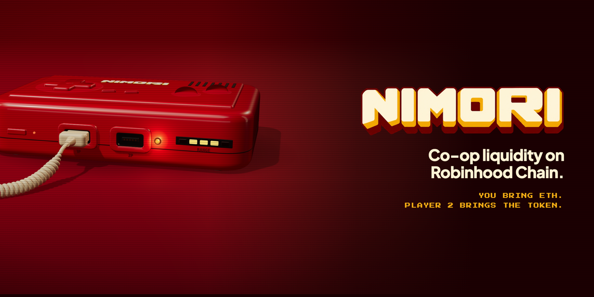

### You bring ETH. Player 2 brings the token.

**[playnimori.com](https://playnimori.com)** · **[@nimoricoop](https://x.com/nimoricoop)** · Robinhood Chain · $NIMORI launches on Pons


</div>

---

<div align="center">
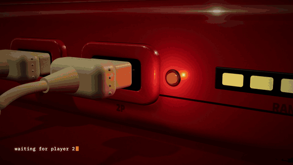
</div>

## What is NIMORI?

Providing liquidity has always been a solo game: you need both sides of a pair, half ETH and half token, and most people only hold one.

NIMORI turns liquidity into a **two-player mode**.

| | |
|---|---|
| 🎮 **Player 1** | deposits ETH |
| 🕹️ **Player 2** | deposits the token |
| 🔌 **Match** | NIMORI pairs them and opens **one** Uniswap v4 position in a NIMORI pool |
| 💾 **Seats** | each side gets a Seat NFT, a *save file* you can sell mid-game |
| ⚖️ **Mover rule** | at exit, the side whose asset moved more carries the impermanent loss |

Nobody has to sell half their bag to become an LP.

> [!IMPORTANT]
> $NIMORI is live on Pons. The first protocol contract, the **Arcade** (stake $NIMORI, earn ETH), is deployed and verified on Robinhood Chain: see [`contracts/`](contracts). Co-op lobbies are being built in public and are **not deployed**: no co-op deposit is possible yet. The app shows no simulated balances, prices or APRs.

---

## ▶ Press start

<table>
<tr>
<td width="50%">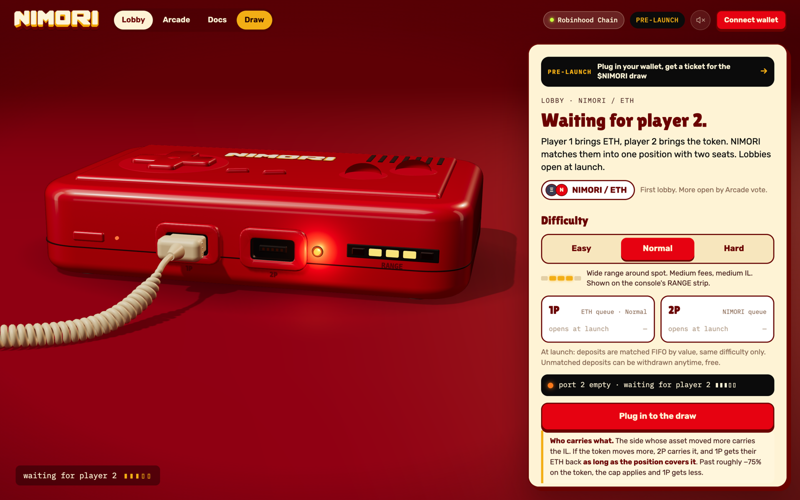</td>
<td width="50%">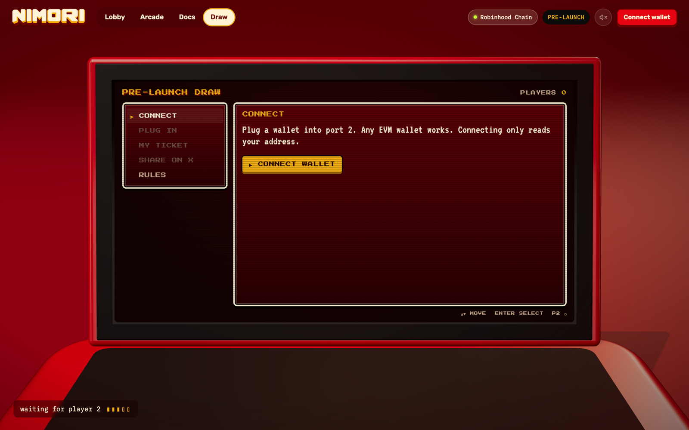</td>
</tr>
<tr>
<td align="center"><b>Lobby</b> · the console waits for player 2</td>
<td align="center"><b>Draw</b> · a retro game menu on the console screen</td>
</tr>
<tr>
<td>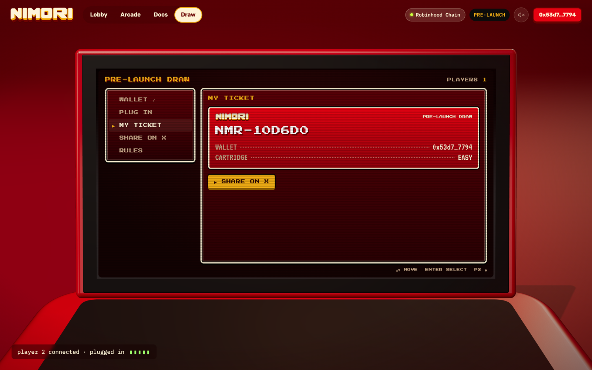</td>
<td>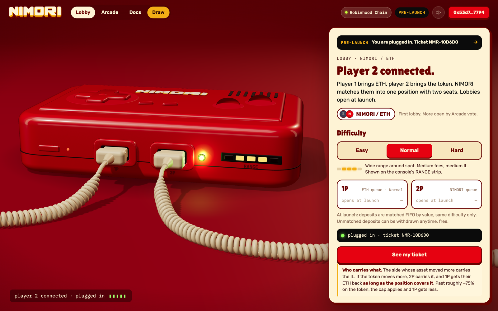</td>
</tr>
<tr>
<td align="center"><b>Ticket</b> · one wallet, one ticket</td>
<td align="center"><b>Plugged in</b> · your entry plugs the 2nd cable in for real</td>
</tr>
<tr>
<td>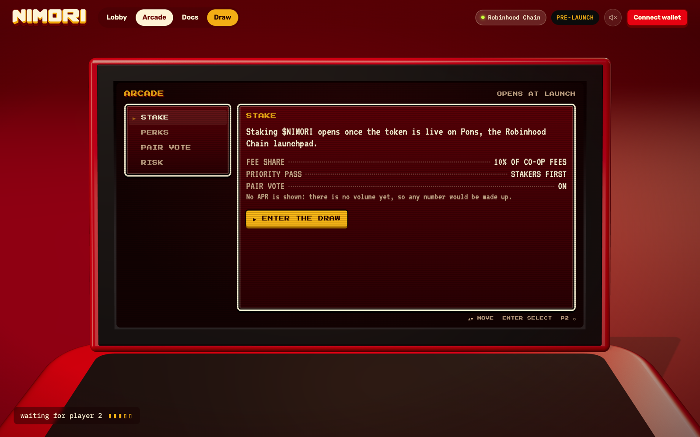</td>
<td>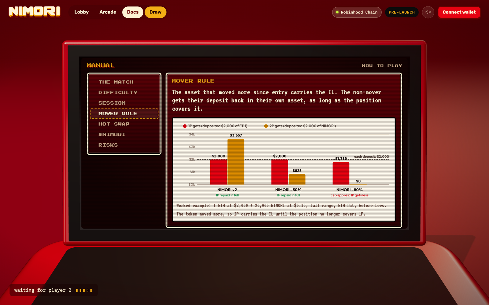</td>
</tr>
<tr>
<td align="center"><b>Arcade</b> · $NIMORI staking, opens at launch</td>
<td align="center"><b>Manual</b> · every rule, illustrated</td>
</tr>
</table>

<div align="center">
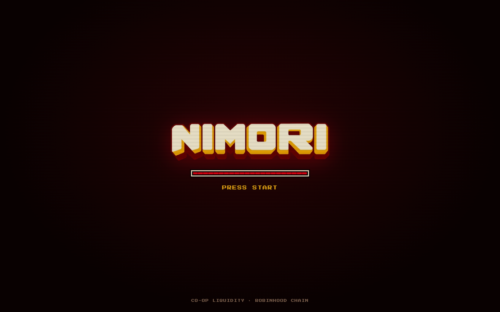
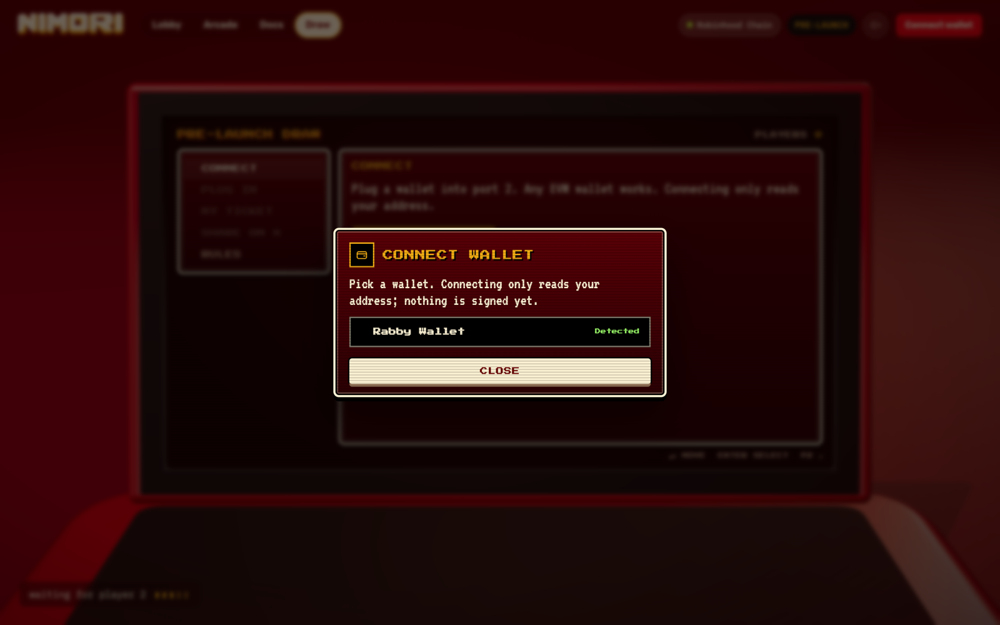
<br>
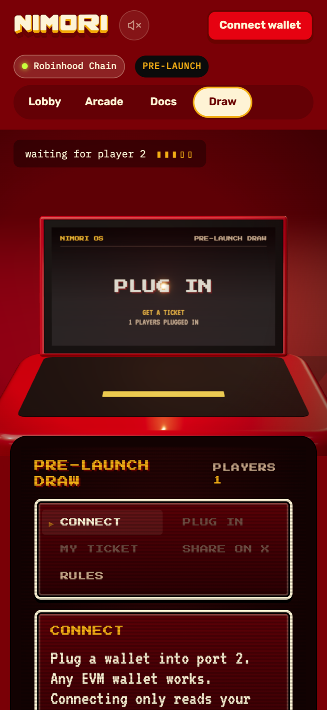
</div>

---

## 🎟️ Pre-launch draw

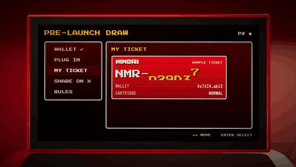

1. **Connect** any EVM wallet (EIP-6963 discovery: Rabby, MetaMask, Coinbase Wallet…).
2. **Plug in**: sign one free message. No transaction, no approval, nothing leaves the wallet.
3. **Get a ticket**: `NMR-XXXXXX`, revealed like a slot machine.
4. **Share on X**, from a real, stored entry.

**Fair by construction**

- The signature is verified **server-side** before anything is stored.
- The ticket is derived from the **address**, so signing again never re-rolls it.
- **One ticket per wallet.** The cartridge on the ticket is cosmetic; every ticket has the same odds.
- **Anti-farming:** at the snapshot block, a wallet needs **at least 1 transaction sent and some ETH for gas on Robinhood Chain**. Fresh empty wallets do not count, so spinning up thousands of addresses buys nothing. The app shows each wallet whether it is eligible right now.
- **Verifiable:** the entry list is frozen and published with its SHA-256 **before** the seed block exists; winners come from that **Robinhood Chain block hash**, with the open-source [`scripts/draw.js`](scripts/draw.js). Anyone can re-run it and get the same winners, so nobody can pick them, the team included.
- Winners receive a **$NIMORI airdrop** after launch. Amount and number of winners are announced before the draw.

> [!CAUTION]
> The draw never asks for a transaction, an approval or a seed phrase, and the team never DMs first. Any post after the pinned *final tweet* that looks like it comes from us is a phishing attempt.

<br clear="right">

---

### How the draw is run

```bash
node scripts/draw.js snapshot                                  # freeze entries → draw/snapshot.json + sha256 (published)
node scripts/draw.js eligible --snapshot-block <N>             # apply the rule at the announced block (archive RPC)
node scripts/draw.js run --seed-block <M> --winners <W>        # winners from the hash of block M (announced in advance)
```

Winners are drawn with a partial Fisher–Yates shuffle over the sorted eligible list, where step *i* uses `keccak256(blockHash ‖ i)`. Same inputs, same winners, for anyone.

---

## ⚙️ How it works

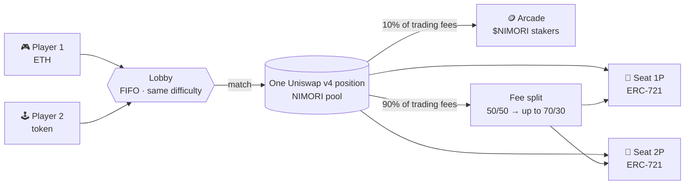

### Difficulty

| Mode | Range | Fees | Risk |
|---|---|---|---|
| **Easy** | Full range | Lower | Lowest IL |
| **Normal** | Wide around spot | Medium | Medium IL |
| **Hard** | Narrow around spot | Highest | Highest IL, can go out of range |

### Session lifecycle

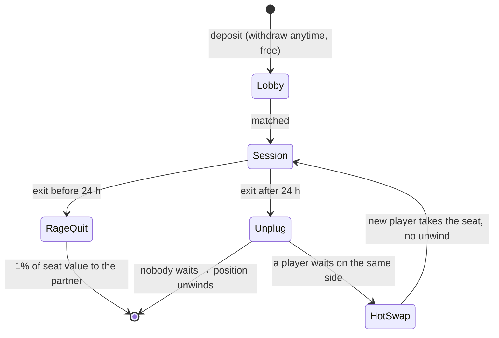

### The mover rule

At exit, compare each asset's USD move since entry. The asset that moved more is the **mover**:

- the **non-mover** gets their deposit back, in their own asset, **as long as the position covers it**;
- the **mover** gets the rest; each seat then adds its share of fees.

Worked example, full range, ETH flat, before fees: 1 ETH at $2,000 + 20,000 NIMORI at $0.10.

| NIMORI moves | Position | 1P gets | 2P gets | |
|---|---|---|---|---|
| ×2 | $5,656.85 | $2,000.00 | $3,656.85 | 1P repaid in full |
| −50% | $2,828.43 | $2,000.00 | $828.43 | 1P repaid in full |
| −80% | $1,788.85 | $1,788.85 | $0.00 | cap applies: 1P gets less |

> [!WARNING]
> On a full-range position, the non-mover is no longer repaid in full once one asset falls about **75%** against the other. See [`docs/nimori-docs.md`](docs/nimori-docs.md) for every rule and risk.

### Where positions live

Pons pools route all swap fees to the Pons hook and pay **zero** to LPs, so co-op positions cannot sit there. Each NIMORI lobby opens its own Uniswap v4 pool on Robinhood Chain, with fees paid to LPs and a NIMORI hook recording the price history used by the matcher and at exit.

---

## 🧱 Tech

| Layer | What |
|---|---|
| **Front** | Vanilla ES modules, no build step. `three@0.170` from jsDelivr via an import map |
| **3D console** | One persistent WebGL scene: clearcoat plastic, PMREM studio softboxes, ACES, coiled cables (`TubeGeometry` on a helix), a hinged lid, a 5-LED RANGE strip |
| **Console screen** | The page is plain 2D HTML **fitted every frame to the projected corners of the 3D screen**: no CSS3D, so it never drifts. Phones get a canvas-texture title card |
| **UI** | Retro game menus (Press Start 2P + VT323, RPG windows, keyboard ▲▼ + Enter), arcade popups, boot screen |
| **Sound** | 8-bit effects synthesised with WebAudio (square/triangle + filtered noise). No audio files. Mute toggle remembered |
| **Wallet** | EIP-6963 discovery, `personal_sign` only. No wallet library |
| **Draw API** | Vercel Function `api/plug.js`: `viem.verifyMessage`, one record per address in **Vercel Blob** |
| **Videos** | Deterministic film rig (`renderAt(t)`), frame-by-frame capture, synthesised chiptune score |

### Project layout

```text
.
├── index.html            app shell, boot screen, import map
├── css/app.css           shell, retro menus, popups, boot screen
├── js/
│   ├── app.js            router, pages, draw flow, retro menu engine
│   ├── scene.js          the three.js console (lid, cables, LEDs, screen fitting)
│   ├── wallet.js         EIP-6963 wallet discovery + personal_sign
│   ├── sound.js          WebAudio arcade effects
│   └── figs.js           SVG figures for the manual
├── api/
│   ├── plug.js           POST: verify signature → store 1 ticket per wallet · GET: count / lookup
│   └── _shared.js        signed message, ticket derivation, storage (Blob or local file)
├── scripts/
│   ├── dev-server.js     static + /api locally, like Vercel
│   └── draw.js           verifiable draw: snapshot → eligible → run
├── film/                 deterministic film pages for the videos
├── videos/               teaser, registration, launch, roadmap, live, player 2
├── contracts/            Solidity (Foundry): NimoriArcade, co-op lobbies next
├── docs/nimori-docs.md   full protocol docs
└── brand/                logo, wordmark, social visuals
```

---

## 🛠️ Run it locally

```bash
git clone https://github.com/nimoricoop/nimori-app.git
cd nimori-app
npm install
npm run dev          # http://localhost:8790  (static site + /api)
```

Locally the draw writes to `/tmp/nimori-draw.json`. On Vercel it uses Blob storage when `BLOB_READ_WRITE_TOKEN` is set.

| Env var | Where | Purpose |
|---|---|---|
| `BLOB_READ_WRITE_TOKEN` | Vercel | Draw storage (linked Blob store) |
| `RH_RPC` | optional | Robinhood Chain RPC, default `https://rpc.mainnet.chain.robinhood.com` |
| `NIMORI_LOCAL_STORE` | optional | Local JSON file for dev entries |
| `DRAW_CLOSES_AT` | Vercel | ISO time after which new entries are refused |

### Draw API

```http
GET  /api/plug                      → { "players": 0 }
GET  /api/plug?address=0x…          → { "entry": { address, ticket, enteredAt } | null, "players": 0 }
POST /api/plug                      → { "ok": true, "ticket": { "code": "NMR-…", "cart": "Normal" }, "players": 1 }
     { "address": "0x…", "issued": "<ISO time>", "signature": "0x…" }
```

Rejections: bad address or signature format (400), a signature older than 30 minutes (400), a signature that does not recover to the address (400), registration closed (403, after `DRAW_CLOSES_AT`). A second entry from the same wallet returns the existing ticket. Responses also carry `eligibleNow` (a hint read from the chain at entry time) and the eligibility `rule`.

Abuse protection: the player count is cached (30 s per instance, CDN-cached `GET`), and `/api/plug` is rate-limited per IP by the Vercel Firewall.

---

## 🎬 Chronology

| | |
|---|---|
| **Chapter 1** · the teaser | [`videos/nimori-teaser.mp4`](videos/nimori-teaser.mp4): the RANGE LEDs rise, the 2nd cable plugs in, the lid opens… cut. |
| **Chapter 2** · registration open | [`videos/nimori-ep2.mp4`](videos/nimori-ep2.mp4): the console boots into the draw menu, a ticket rolls and locks. |
| **Chapter 3** · launch tomorrow | [`videos/nimori-launch.mp4`](videos/nimori-launch.mp4): full power, READY, LAUNCH · TOMORROW · 10.01. |
| **Chapter 4** · roadmap | [`videos/nimori-roadmap.mp4`](videos/nimori-roadmap.mp4): world select, stage 0 to the boss level. |
| **Chapter 5** · live | [`videos/nimori-live.mp4`](videos/nimori-live.mp4): GAME START · $NIMORI IS LIVE ON PONS. |
| **Chapter 6** · player 2 | [`videos/nimori-player2.mp4`](videos/nimori-player2.mp4): port 2 empty… plugged. No NIMORI, no game. |

<div align="center">
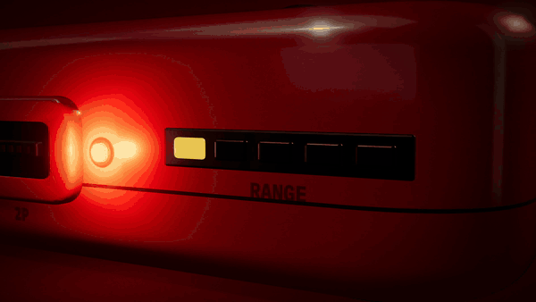
</div>

---

## 🗺️ Roadmap

- [x] Brand, console, retro game UI
- [x] Manual with illustrated rules
- [x] **Pre-launch draw**: live on [playnimori.com](https://playnimori.com)
- [x] $NIMORI launch on Pons
- [ ] Public draw from an announced Robinhood Chain block, airdrop to winners
- [x] `NimoriArcade` deployed + verified: [`0x3341…a959`](https://robinhoodchain.blockscout.com/address/0x3341b6130eB70A39e2304Cf5eCB6B1fd533dA959)
- [ ] Co-op lobbies: queues, matcher, seat NFTs, mover rule, NIMORI v4 hook (building in public)
- [ ] Audit status published before deposits open
- [ ] First lobby: NIMORI / ETH

---

<div align="center">

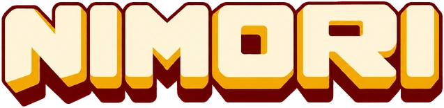

**waiting for player 2 ▮▮▮▮▯**

[playnimori.com](https://playnimori.com) · [@nimoricoop](https://x.com/nimoricoop)

</div>
